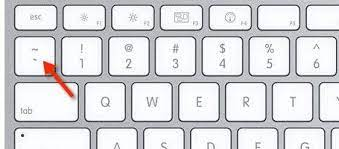
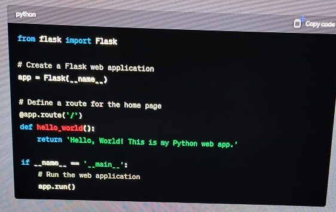
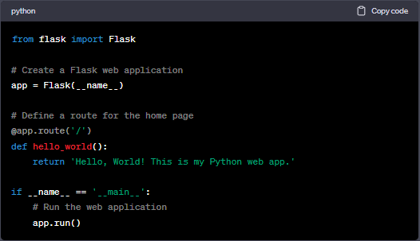
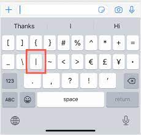

# Writing Good Documentation

## Step 1 - Using Codeblocks.

Codeblocks in markdown make it *very easy* for tech people to **copy, paste, share** code.
A good _Cloud Engineer_ uses Codeblocks whenever possible.

Because it allows others to copy and paste, their codes to replicate or research issues.


- Inorder to create Codeblocks in markdown you need to use three backticks ( ` )
- Not to be confused with qutations ( ' )

```
from flask import Flask

# Create a Flask web application
app = Flask(__name__)

# Define a route for the home page
@app.route('/')
def hello_world():
    return 'Hello, World! This is my Python web app.'

if __name__ == '__main__':
    # Run the web application
    app.run()
```

- When you can you should attempt to apply syntax highlighting to your Codeblocks.

```py
from flask import Flask

# Create a Flask web application
app = Flask(__name__)

# Define a route for the home page
@app.route('/')
def hello_world():
    return 'Hello, World! This is my Python web app.'

if __name__ == '__main__':
    # Run the web application
    app.run()
```

- Make note of where the backtick key is.



- Good Cloud Engineers use Codeblocks for both code and Errors that appear in the console.

```bash

bash: command not found: some_command
```

> Here is an example of using a codeblock for an error that appears in bash.

When you can always provide a codeblock nstead of a screenshot.
If you need to take a screenshot make sure its not from your phone.

> There are certain cases to tae photos with your phone. This is when you are showing like a keyboad, which does not appear on a computer screen. If it render on your computer screen it should be a screenshot.

## Step 2 - Taking Screenshots

A screenshot is when you capture a part of your screen from your Desktop or phone.

This is not to be confused with take a photo with your phone.

**Don't do this**



This is what a screenshot from your computer should look like.

**Do this instead**



To take screenshots on both Mac and Windows computers, you can use keyboard shortcuts. Here are the common hotkeys for taking screenshots on each platform:

**For Mac:**

1. **Capture Entire Screen:**
   - Press `Shift + Command (⌘) + 3` simultaneously.
   - The screenshot will be saved to your desktop by default.

2. **Capture Selected Portion of the Screen:**
   - Press `Shift + Command (⌘) + 4`.
   - Use your mouse to select the portion of the screen you want to capture.
   - The screenshot will be saved to your desktop by default.

3. **Capture a Specific Window:**
   - Press `Shift + Command (⌘) + 4`, then press `Spacebar`.
   - Click on the window you want to capture.
   - The screenshot will be saved to your desktop by default.

**For Windows:**

1. **Capture Entire Screen:**
   - Press `PrtScn` (Print Screen) key. On some keyboards, you may need to press `Fn + PrtScn`.
   - The screenshot is copied to your clipboard and can be pasted into an image editing program (e.g., Paint) to be saved.

2. **Capture Active Window:**
   - Press `Alt + PrtScn`.
   - The screenshot of the active window is copied to your clipboard.

3. **Capture a Selected Portion of the Screen (Windows 10 and later):**
   - Press `Windows + Shift + S`.
   - Use the cursor to select the portion of the screen you want to capture.
   - The screenshot is copied to your clipboard and can be pasted into an image editing program.

4. **Capture the Entire Screen and Save as a File (Windows 10 and later):**
   - Press `Windows + Shift + S`, then press `Enter`.
   - The screenshot is captured and saved to the "Screenshots" folder within your "Pictures" library.

Please note that the specific key combinations and options may vary slightly depending on your version of macOS or Windows, so if you're using an older version, the shortcuts might be slightly different. Additionally, you can customize screenshot settings and destinations in your system preferences on both Mac and Windows.

## Step 3 - Use Github Flavoured Task List

Github extends markdown to have a list where you can check off items. <sup>[1]</sup>

- [x] Finish Step 1
- [ ] Finish Step 2
- [x] Finish Step 3

# Step 4 - Use Emojis (Optional)

GFM  supports emoji shortcodes.

- Here are some examples.

```md
| --- | --- | --- |
| Cloud | `:cloud:` | :cloud: |
| Cloud with rain | `:cloud_with_rain:` | 🌧️ |
```

## Step 5 - How to Create a table

You can use the following markdown format to creaate tables:

```md
| Name | Shortcode | Emoji |
| --- | --- | --- |
| Cloud | : cloud : | :cloud: |
| Cloud with lightning | : cloud_with_lightning : | 🌩️ |
```
Github extends the functionality of markdown tables to provide more alignment and table cell formatting options. [<sup>[2]</sup>](#external-references)

- Make note of where the backtick character is located.
- It should appear above the Tab key,
- but it may vary based on your keyboard layout.




## External References

- [Basic writing and formatting syntax](https://docs.github.com/en/get-started/writing-on-github/getting-started-with-writing-and-formatting-on-github/basic-writing-and-formatting-syntax#images) 
- [GitHub Flavored Markdown Spec](https://github.github.com/gfm/)
- [GFM - Task Lists](https://docs.github.com/en/get-started/writing-on-github/getting-started-with-writing-and-formatting-on-github/basic-writing-and-formatting-syntax#task-lists) <sup>[1]</sup>
- [GFM - Emoji CheatSheet](https://github.com/ikatyang/emoji-cheat-sheet#smileys--emotion)
- [GFM - Tables with Extensions](https://github.github.com/gfm/#tables-extension-)  <sup>[2]</sup>


